# Arquitectura de Entornos VitSync

Este documento detalla cómo se conectan los distintos entornos del sistema VitSync (Local, Testing y Producción) y qué variables de configuración son necesarias para cada uno.

## Diagrama de Conexiones

```mermaid
graph TD
    subgraph LOCAL["💻 Entorno Local (Tu PC)"]
        LocalFront["Frontend Local<br>localhost:5173"] -->|API HTTP| LocalAPI["API Local<br>localhost:8080"]
        LocalAPI -->|JDBC| NeonTesting["Neon DB (Testing)<br>vitsync-testing"]
    end

    subgraph TESTING["🧪 Entorno Testing (Nube)"]
        TestFront["Vercel (Testing)<br>vitsync-web-app-testing.vercel.app"] -->|API HTTPS| TestAPI["Render (Testing)<br>vitsync-api-testing.onrender.com"]
        TestAPI -->|JDBC| NeonTesting
    end

    subgraph PROD["🚀 Entorno Producción (Nube)"]
        ProdFront["Vercel (Prod)<br>vitsync.es"] -->|API HTTPS| ProdAPI["Render (Prod)<br>vitsync-api.onrender.com"]
        ProdAPI -->|JDBC| NeonProd["Neon DB (Prod)<br>vitsync-prod"]
    end

    style LOCAL fill:#f9f,stroke:#333,stroke-width:2px
    style TESTING fill:#ccf,stroke:#333,stroke-width:2px
    style PROD fill:#cfc,stroke:#333,stroke-width:2px
```

---

## 1. Entorno Local (Desarrollo)
Todo corre en tu máquina, pero se conecta a la base de datos de pruebas en la nube.

| Componente | URL | Configuración (Archivo) |
|---|---|---|
| **Frontend** | `http://localhost:5173` | `.env.development` `VITE_API_URL=http://localhost:8080` |
| **API** | `http://localhost:8080` | `src/main/resources/application-dev.properties` `spring.datasource.url=...vitsync-testing` |

> **Nota**: Para ejecutar el backend en modo local, usa el perfil `dev` (`-Dspring.profiles.active=dev`).

---

## 2. Entorno Testing (Rama `develop`)
Despliegue automático desde la rama `develop`. Sirve para probar cambios en la nube antes de pasar a producción.

| Componente | URL | Configuración (Variables de Entorno) |
|---|---|---|
| **Frontend** | `https://vitsync-web-app-testing.vercel.app` | **Vercel (Project Testing)**: `VITE_API_URL = https://vitsync-api-testing.onrender.com` |
| **API** | `https://vitsync-api-testing.onrender.com` | **Render (Service Testing)**: `DATABASE_URL = ...vitsync-testing` `CORS_ALLOWED_ORIGINS = https://vitsync-web-app-testing.vercel.app` |

---

## 3. Entorno Producción (Rama `master`)
La versión final estable para los usuarios.

| Componente | URL | Configuración (Variables de Entorno) |
|---|---|---|
| **Frontend** | `https://vitsync.es` | **Vercel (Project Prod)**: `VITE_API_URL = https://vitsync-api.onrender.com` |
| **API** | `https://vitsync-api.onrender.com` | **Render (Service Prod)**: `DATABASE_URL = ...vitsync-prod` `CORS_ALLOWED_ORIGINS = https://vitsync.es` |

---

## 🔑 Checklist de Variables Clave

### Frontend (Vercel)
Asegúrate de configurar estas variables en el panel de Vercel para cada entorno:
- `VITE_API_URL`: La URL del backend correspondiente.
- `VITE_TALKJS_APP_ID`: Tu ID de TalkJS.

### Backend (Render)
Asegúrate de configurar estas variables en el panel de Render:
- `DATABASE_URL`: String de conexión a Neon (empezando por `jdbc:postgresql://...`).
- `DATABASE_USERNAME`: Usuario de la BD.
- `DATABASE_PASSWORD`: Contraseña de la BD.
- `JWT_SECRET`: Clave secreta larga para firmar tokens.
- `RESEND_API_KEY`: Clave de API para enviar correos.
- `CORS_ALLOWED_ORIGINS`: La URL exacta de tu frontend (sin barra al final).
